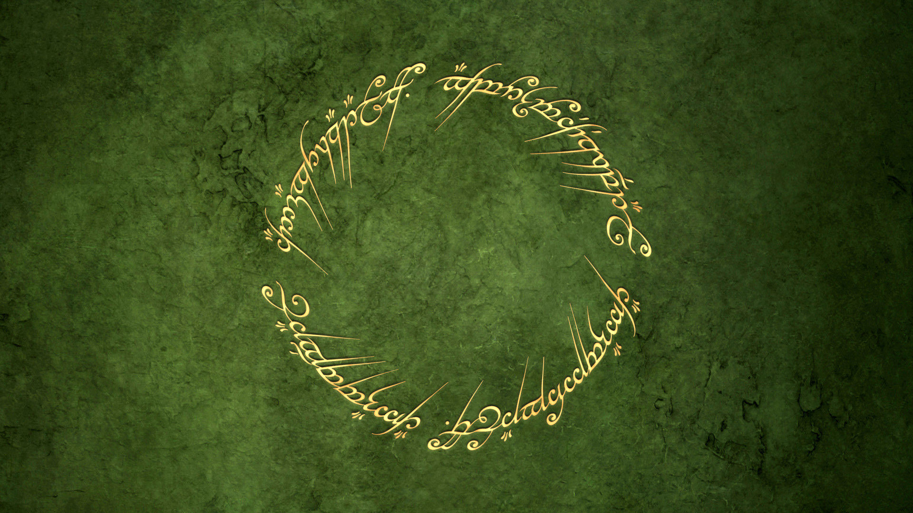

# RingBus 针对Android事件总线
============



说明描述

 * subscribe(), 订阅
 * unSubscribe(), 取消订阅
 * @Ring注解:
 *  (filter = "RingObject"),消息接收过滤字,
 *  receiveRingObject(RingObject object), 事件接收方法, RingObject 消息体

```java
class SubscribeModule  {

    public void attach() {

	    super.init();
	    RingSubscriber.subscribe(this);
    }

    public void detach(){

	    RingSubscriber.unSubscribe(this);
    }

    @Ring(filter = "RingObject")
    protected void receiveRingObject(RingObject object) {

        //TODO use object value
    }
}
```


```java
class RingCallModule  {

  @Override public void doAction() {

	RingSubscriber.ringCall("RingObject", ringObject);
    // TODO push ringObject value...
  }


```

License
-------

    Copyright 2016 easybenefit

    Licensed under the Apache License, Version 2.0 (the "License");
    you may not use this file except in compliance with the License.
    You may obtain a copy of the License at

       http://www.apache.org/licenses/LICENSE-2.0

    Unless required by applicable law or agreed to in writing, software
    distributed under the License is distributed on an "AS IS" BASIS,
    WITHOUT WARRANTIES OR CONDITIONS OF ANY KIND, either express or implied.
    See the License for the specific language governing permissions and
    limitations under the License.
